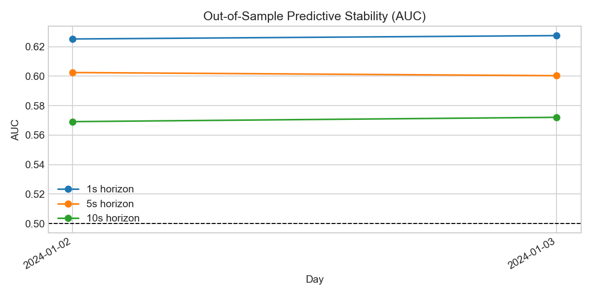
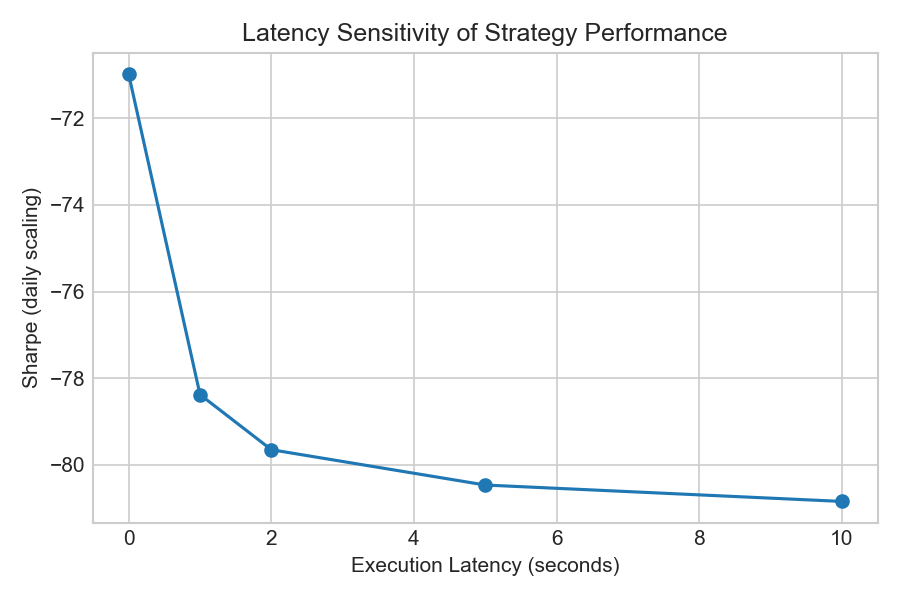
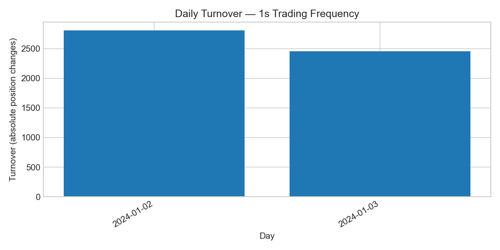
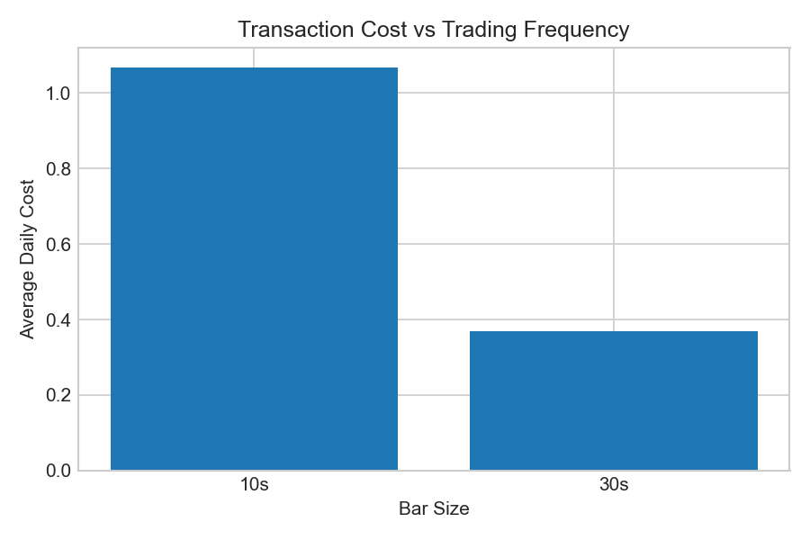
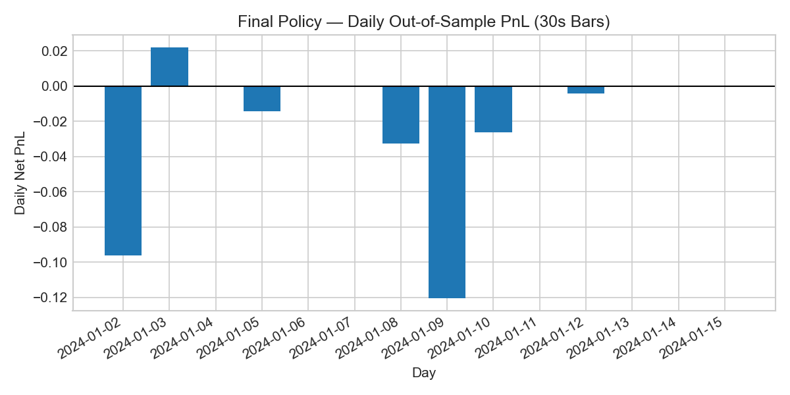

# Project 1 — Short-Horizon Crypto Return Prediction: Signal Discovery and Execution Limits

## Abstract

This project investigates whether short-horizon return predictability in cryptocurrency markets can be monetized after realistic execution costs. Using BTCUSDT trade and bar data at 1-second resolution, I construct microstructure-inspired features and train a simple, interpretable logistic regression model under strict walk-forward, out-of-sample evaluation. While the model exhibits stable predictive power (out-of-sample AUC ≈ 0.6 across multiple days and horizons), naive high-frequency execution leads to substantial losses due to extreme turnover and transaction costs. I systematically analyze execution failure modes and test mitigations including latency modeling, minimum holding periods, threshold hysteresis, regime gating, and coarser trading horizons. Moving to 30-second bars with enforced holding periods recovers a large fraction of the signal’s value and dramatically reduces costs, but the strategy remains slightly unprofitable over a 14-day out-of-sample period. The results demonstrate a complete research loop from signal discovery to economic falsification, highlighting that execution constraints dominate machine learning performance at short horizons.

---

## 1. Motivation and Research Question

Cryptocurrency markets trade continuously, exhibit high liquidity, and generate rich microstructure data, making them attractive for short-horizon predictive modeling. However, many machine learning signals that appear statistically significant fail to translate into profitable strategies once realistic execution costs are considered.

The central research question of this project is:

> **Can short-horizon return predictability in BTC be monetized after accounting for realistic transaction costs and execution constraints?**

Rather than optimizing for headline PnL, the goal is to understand *why* a statistically valid signal may fail economically and to identify the limits of execution-aware monetization.

---

## 2. Data Acquisition and Integrity

### Data Sources
- **Primary:** Binance `aggTrades` API (when accessible)
- **Fallback:** Binance Vision daily 1-second klines
- **Asset:** BTCUSDT
- **Timezone:** UTC
- **Granularity:** 1-second bars, later resampled to 10s and 30s

### Integrity and Quality Checks
Each trading day is processed independently with explicit diagnostics:
- Monotonic timestamp enforcement
- Duplicate timestamp removal
- Missing-bin detection on a full 1-second grid
- OHLC sanity checks (high/low consistency)
- Non-negative volume and trade counts

All processed days used in modeling have:
- Zero missing 1-second bins
- Zero duplicate timestamps
- Clean, continuous time grids

This ensures downstream results are not artifacts of data corruption.

---

## 3. Feature Construction

Features are constructed to reflect short-horizon market microstructure intuition while remaining causal and interpretable.

### Feature Groups
- **Returns:** 1s, 5s, 10s log returns
- **Volatility:** rolling short-horizon return volatility
- **Activity:** rolling volume and trade-count proxies
- **Range / Spread proxies:** high–low based measures
- **Directional pressure proxies:** simple price–range relationships

All features use backward-looking rolling windows only. Rows with insufficient history are dropped to prevent leakage.

---

## 4. Target Definition and Leakage Control

Targets are defined as forward log returns and directional indicators:
- `y_ret_h`: forward log return over horizon `h`
- `y_up_h`: binary indicator of positive return

Horizons evaluated:
- 1s, 5s, 10s (1-second data)
- 30s, 90s (resampled data)

Strict safeguards against leakage include:
- Walk-forward daily training
- No cross-day information sharing
- Alignment by timestamp joins only
- Tail-row removal where forward returns are undefined

---

## 5. Modeling and Validation

### Model Choice
A **logistic regression** classifier is used deliberately:
- High interpretability
- Stable behavior under small samples
- Reduced overfitting risk relative to complex models

### Evaluation Methodology
- Daily walk-forward training
- Strict out-of-sample prediction
- Performance measured via AUC and realized PnL

### Key Result
Across multiple days and horizons, the model achieves:
- **Out-of-sample AUC consistently above 0.6**

This establishes that the signal contains real predictive information.

---

## 6. Single-Day Backtesting and Execution Failure

A realistic execution-aware backtest is implemented, incorporating:
- Latency (signal-to-execution delay)
- Taker fees
- Spread / slippage proxies
- Position changes as the cost driver

### Observations
- The raw signal trades extremely frequently at 1-second resolution
- Turnover is very high
- Transaction costs dominate gross returns
- Net PnL is strongly negative despite good predictive accuracy

Latency sweeps confirm that execution friction, not model quality, is the dominant failure mode.

---

## 7. Systematic Mitigation Attempts

Several execution-aware mitigations are tested systematically:

### Minimum Holding Periods
- Reduces turnover
- Improves net PnL
- Excessive holding degrades edge capture

### Threshold Hysteresis
- Trading only on high-confidence predictions
- Strong reduction in trade count
- Improves worst-day losses

### Regime Gating
- High-volatility-only trading
- Reduces activity but does not improve payoff density
- No clear benefit in limited samples

### Coarser Trading Horizons
- Resampling to 10s and 30s bars
- Rebuilding features and targets
- Trading aligned with the signal’s natural horizon

---

## 8. Coarser-Horizon Recovery Experiment

The most effective mitigation is trading at a coarser frequency.

### Final Fixed Policy (Pre-Committed)
- Bars: **30 seconds**
- Trade horizon: **90 seconds**
- Minimum hold: **90 seconds**
- Thresholds: **0.65 / 0.35**
- Model: unchanged logistic regression

### Multi-Day Out-of-Sample Results (14 Days)

Summary statistics:
- Mean daily PnL: **−0.019**
- Std daily PnL: 0.040
- Fraction positive days: **7.1%**
- Mean daily cost: **0.030**
- Mean turnover: **~16 trades/day**

Losses are small and bounded, and turnover collapses by ~30× relative to 1-second execution. However, the strategy remains slightly unprofitable.

---

## Empirical Results and Diagnostics

### Predictive Signal Stability

**Figure 1. Out-of-sample predictive stability across multiple days.**  
This figure reports the daily out-of-sample AUC for logistic regression models trained on prior days and evaluated on the current day, for prediction horizons of 1s, 5s, and 10s. The dashed horizontal line denotes the random baseline (AUC = 0.5). Across all horizons, predictive performance remains consistently above chance, demonstrating that the learned microstructure features contain genuine directional signal that generalizes across days.

### Sensitivity to Execution Latency

**Figure 2. Strategy performance sensitivity to execution latency.**  
Daily Sharpe ratio (scaled from 1-second returns) is plotted as a function of assumed execution latency. Performance deteriorates sharply even under modest delays, highlighting the fragility of ultra–short-horizon predictive signals to realistic execution constraints.

### Turnover and Trading Frequency

**Figure 3. Daily turnover under 1-second trading frequency.**  
This figure shows total daily turnover when trading at 1-second resolution. Turnover is extremely high across all days, implying frequent position flipping and heavy transaction cost accumulation. This explains why the strategy remains unprofitable despite strong out-of-sample predictive accuracy.

### Transaction Costs Across Frequencies

**Figure 4. Average transaction cost as a function of trading frequency.**  
Average daily transaction costs are shown for strategies operating at different bar resolutions. Moving from 1-second to 10-second and 30-second bars substantially reduces costs by lowering turnover, motivating the exploration of coarser execution horizons.

### Final Fixed Trading Policy

**Figure 5. Daily out-of-sample PnL for the final fixed trading policy.**  
This figure reports daily net PnL for a pre-specified policy operating on 30-second bars with a 90-second holding period and conservative probability thresholds. While turnover and costs are significantly reduced, average PnL remains slightly negative, demonstrating that the signal is not economically strong enough to overcome transaction costs.

---

## 9. Conclusions and Lessons Learned

This project demonstrates a complete and realistic quantitative research loop:

1. Short-horizon return predictability exists in BTC
2. Predictive accuracy alone does not guarantee profitability
3. Execution costs dominate at high frequency
4. Systematic execution-aware mitigations can recover substantial edge
5. Even disciplined execution may be insufficient for economic viability

The final result is a **well-supported negative conclusion**: the signal is real but too weak to monetize under conservative assumptions.

This outcome mirrors real-world quant research, where most statistically valid signals fail at the execution layer.

---

## 10. Future Work

Potential extensions informed by this project include:
- Longer-horizon signals (minutes rather than seconds)
- Cross-sectional crypto strategies
- True level-2 order book features
- Regime-aware modeling from inception

These directions are left for future projects.

---

## Appendix: Repository Structure

The full, reproducible pipeline is implemented in a modular research repository:

- Data ingestion and quality checks
- Feature engineering
- Walk-forward modeling
- Execution-aware backtesting
- Multi-day stability analysis

All experiments are fully reproducible from the repository.

